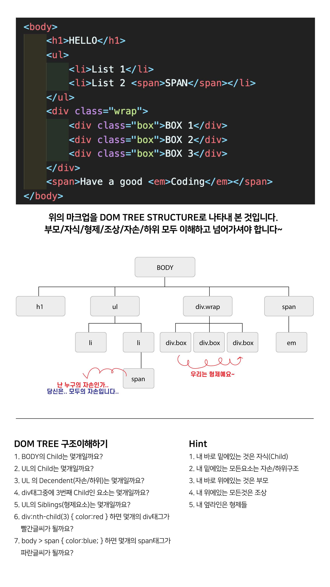

# DOM TREE 구조 이해하기

### 1. Body의 Child는 몇개?

- 4개 ()

### 2. ul의 child는 몇개?

- 2개

### 3. ul의 deceendent는 몇개?

- 3개

### 4.div태그중에 3번째 child인 요소는 몇개?

- 2개 (div.wrap / div.box(3번째))

### 5.ul의 Sibling(형제요소)는 몇개?

- 4개

### 6. div:nth-child(3){color:red} 하면 몇개의 div 태그가 빨간글씨가 될까요?

- 2개 (div.wrap / div.box(3번째))

### 7.body>span {color:blue;}하면 몇개의 span태그가 파란글씨가 될까요?

- 1개
